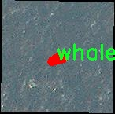

### 1.背景意义

研究背景与意义

鲸鱼作为海洋生态系统的重要组成部分，其生存状态和种群数量的变化直接影响着海洋生态的健康与平衡。近年来，随着全球气候变化和人类活动的加剧，鲸鱼的栖息地遭到严重威胁，导致其数量急剧下降。因此，开展对鲸鱼的监测与保护工作显得尤为重要。传统的鲸鱼监测方法往往依赖于人工观察和记录，效率低下且容易受到人为因素的影响。随着计算机视觉技术的快速发展，基于深度学习的图像处理方法为鲸鱼的自动识别与监测提供了新的可能性。

在众多计算机视觉技术中，实例分割作为一种精细化的图像分析方法，能够对图像中的每一个对象进行精确的分割与识别，尤其适用于复杂背景下的物体检测。YOLO（You Only Look Once）系列模型因其高效性和准确性，成为实例分割领域的热门选择。YOLOv11作为该系列的最新版本，具备更强的特征提取能力和更快的推理速度，为鲸鱼的实例分割提供了良好的技术基础。

本研究旨在基于改进的YOLOv11模型，构建一个高效的鲸鱼实例分割系统。通过对包含3800张鲸鱼图像的数据集进行训练与测试，我们希望能够实现对鲸鱼个体的准确识别与分割，从而为鲸鱼的保护和管理提供科学依据。此外，该系统的成功应用不仅能够提升鲸鱼监测的效率，还能为其他海洋生物的监测与保护提供借鉴，推动海洋生态保护的研究进程。通过这一研究，我们期望能够为海洋生态保护贡献一份力量，同时为计算机视觉技术在生物监测领域的应用开辟新的方向。

### 2.视频效果

[2.1 视频效果](https://www.bilibili.com/video/BV1VMCAY7E2w/)

### 3.图片效果


##### [项目涉及的源码数据来源链接](https://kdocs.cn/l/cszuIiCKVNis)**

注意：本项目提供训练的数据集和训练教程,由于版本持续更新,暂不提供权重文件（best.pt）,请按照6.训练教程进行训练后实现上图演示的效果。

### 4.数据集信息

##### 4.1 本项目数据集类别数＆类别名

nc: 1
names: ['whale']


该项目为【图像分割】数据集，请在【训练教程和Web端加载模型教程（第三步）】这一步的时候按照【图像分割】部分的教程来训练

##### 4.2 本项目数据集信息介绍

本项目数据集信息介绍

本项目所使用的数据集专注于鲸鱼实例分割任务，旨在改进YOLOv11模型的性能，以实现更高效的鲸鱼检测与分割。数据集中包含了丰富的鲸鱼图像，所有图像均经过精心挑选和标注，以确保数据的质量和多样性。该数据集的类别数量为1，专注于鲸鱼这一特定对象，类别名称为“whale”。这一单一类别的选择，旨在深入研究鲸鱼的特征和形态，提升模型在该类对象上的识别精度。

数据集中的图像涵盖了不同种类的鲸鱼及其栖息环境，展示了鲸鱼在自然状态下的多样性，包括不同的姿态、光照条件和背景环境。这种多样性不仅有助于模型学习鲸鱼的不同外观特征，还能增强模型在实际应用中的鲁棒性。此外，数据集中还包含了鲸鱼在水下和水面不同角度的图像，提供了丰富的上下文信息，帮助模型更好地理解鲸鱼的行为和位置。

为了确保数据集的有效性，所有图像均经过专业的标注流程，确保每一只鲸鱼都被准确地框定和标记。这种精确的标注为训练改进YOLOv11模型提供了坚实的基础，使其能够在实例分割任务中实现更高的准确率和召回率。通过对这一数据集的深入分析和应用，我们期望能够推动鲸鱼保护研究的发展，并为相关领域的科学研究提供有力支持。





### 5.全套项目环境部署视频教程（零基础手把手教学）

[5.1 所需软件PyCharm和Anaconda安装教程（第一步）](https://www.bilibili.com/video/BV1BoC1YCEKi/?spm_id_from=333.999.0.0&vd_source=bc9aec86d164b67a7004b996143742dc)


[5.2 安装Python虚拟环境创建和依赖库安装视频教程（第二步）](https://www.bilibili.com/video/BV1ZoC1YCEBw?spm_id_from=333.788.videopod.sections&vd_source=bc9aec86d164b67a7004b996143742dc)

### 6.改进YOLOv11训练教程和Web_UI前端加载模型教程（零基础手把手教学）

[6.1 改进YOLOv11训练教程和Web_UI前端加载模型教程（第三步）](https://www.bilibili.com/video/BV1BoC1YCEhR?spm_id_from=333.788.videopod.sections&vd_source=bc9aec86d164b67a7004b996143742dc)


按照上面的训练视频教程链接加载项目提供的数据集，运行train.py即可开始训练



     Epoch   gpu_mem       box       obj       cls    labels  img_size
     1/200     20.8G   0.01576   0.01955  0.007536        22      1280: 100%|██████████| 849/849 [14:42<00:00,  1.04s/it]
               Class     Images     Labels          P          R     mAP@.5 mAP@.5:.95: 100%|██████████| 213/213 [01:14<00:00,  2.87it/s]
                 all       3395      17314      0.994      0.957      0.0957      0.0843

     Epoch   gpu_mem       box       obj       cls    labels  img_size
     2/200     20.8G   0.01578   0.01923  0.007006        22      1280: 100%|██████████| 849/849 [14:44<00:00,  1.04s/it]
               Class     Images     Labels          P          R     mAP@.5 mAP@.5:.95: 100%|██████████| 213/213 [01:12<00:00,  2.95it/s]
                 all       3395      17314      0.996      0.956      0.0957      0.0845

     Epoch   gpu_mem       box       obj       cls    labels  img_size
     3/200     20.8G   0.01561    0.0191  0.006895        27      1280: 100%|██████████| 849/849 [10:56<00:00,  1.29it/s]
               Class     Images     Labels          P          R     mAP@.5 mAP@.5:.95: 100%|███████   | 187/213 [00:52<00:00,  4.04it/s]
                 all       3395      17314      0.996      0.957      0.0957      0.0845


###### [项目数据集下载链接](https://kdocs.cn/l/cszuIiCKVNis)

### 7.原始YOLOv11算法讲解

YOLO11采用改进的骨干和颈部架构，增强了特征提取能力，提高了物体检测的精确度和复杂任务的表现。YOLO11引入精炼的架构设计和优化的训练流程，实现更快的处理速度，同时保持精度和性能之间的最佳平衡。通过模型设计的进步，YOLO11m在COCO数据集上实现了更高的均值平均精度（mAP），同时使用比YOLOv8m少22%的参数，使其在不妥协准确性的情况下更加计算高效。YOLO11可以无缝部署在各种环境中，包括边缘设备、云平台以及支持NVIDIA
GPU的系统，确保最大灵活性。无论是物体检测、实例分割、图像分类、姿态估计，还是定向物体检测（OBB），YOLO11都旨在应对多样的计算机视觉挑战。


##### **Ultralytics YOLO11相比于之前版本的主要改进有哪些？**

Ultralytics YOLO11在其前身基础上引入了几项重要进步。主要改进包括：

  1. **增强的特征提取** ：YOLO11采用改进的骨干和颈部架构，增强了特征提取能力，提高了物体检测的精确度。
  2.  **优化的效率和速度** ：精炼的架构设计和优化的训练流程实现了更快的处理速度，同时保持了准确性和性能之间的平衡。
  3.  **更高的准确性与更少的参数** ：YOLO11m在COCO数据集上实现了更高的均值平均精度（mAP），同时使用比YOLOv8m少22%的参数，使其在不妥协准确性的情况下更加计算高效。
  4.  **环境适应性强** ：YOLO11可以在多种环境中部署，包括边缘设备、云平台以及支持NVIDIA GPU的系统。
  5.  **支持广泛的任务** ：YOLO11支持多种计算机视觉任务，如物体检测、实例分割、图像分类、姿态估计和定向物体检测（OBB）。

我们先来看一下其网络结构有什么变化，可以看出，相比较于YOLOv8模型，其将CF2模块改成C3K2，同时在SPPF模块后面添加了一个C2PSA模块，且将YOLOv10的head思想引入到YOLO11的head中，使用深度可分离的方法，减少冗余计算，提高效率。下面我们来详细看一下这两个模块的结构是怎么构成的，以及它们为什么要这样设计


##### C3K2的网络结构

从下面图中我们可以看到，C3K2模块其实就是C2F模块转变出来的，它代码中有一个设置，就是当c3k这个参数为FALSE的时候，C3K2模块就是C2F模块，也就是说它的Bottleneck是普通的Bottleneck；反之当它为true的时候，将Bottleneck模块替换成C3模块。


##### C2PSA的网络结构

` `C2PSA是对 `C2f` 模块的扩展，它结合了PSA(Pointwise Spatial
Attention)块，用于增强特征提取和注意力机制。通过在标准 `C2f` 模块中引入 PSA
块，C2PSA实现了更强大的注意力机制，从而提高了模型对重要特征的捕捉能力。


##### **C2f 模块回顾：**

**** C2f模块是一个更快的 CSP（Cross Stage Partial）瓶颈实现，它通过两个卷积层和多个 Bottleneck
块进行特征提取。相比传统的 CSPNet，C2f 优化了瓶颈层的结构，使得计算速度更快。在 C2f中，`cv1` 是第一个 1x1
卷积，用于减少通道数；`cv2` 是另一个 1x1 卷积，用于恢复输出通道数。而 `n` 是一个包含 Bottleneck 块的数量，用于提取特征。

##### **C2PSA 模块的增强** ：

**C2PSA** 扩展了 C2f，通过引入PSA( **Position-Sensitive Attention)**
，旨在通过多头注意力机制和前馈神经网络来增强特征提取能力。它可以选择性地添加残差结构（shortcut）以优化梯度传播和网络训练效果。同时，使用FFN
可以将输入特征映射到更高维的空间，捕获输入特征的复杂非线性关系，允许模型学习更丰富的特征表示。

##### head部分

YOLO11在head部分的cls分支上使用深度可分离卷积 ，具体代码如下，cv2边界框回归分支，cv3分类分支。

    
    
     self.cv2 = nn.ModuleList(
                nn.Sequential(Conv(x, c2, 3), Conv(c2, c2, 3), nn.Conv2d(c2, 4 * self.reg_max, 1)) for x in ch
            )
            self.cv3 = nn.ModuleList(
                nn.Sequential(
                    nn.Sequential(DWConv(x, x, 3), Conv(x, c3, 1)),
                    nn.Sequential(DWConv(c3, c3, 3), Conv(c3, c3, 1)),
                    nn.Conv2d(c3, self.nc, 1),
                )
                for x in ch
            )


### 8.200+种全套改进YOLOV11创新点原理讲解

#### 8.1 200+种全套改进YOLOV11创新点原理讲解大全

由于篇幅限制，每个创新点的具体原理讲解就不全部展开，具体见下列网址中的改进模块对应项目的技术原理博客网址【Blog】（创新点均为模块化搭建，原理适配YOLOv5~YOLOv11等各种版本）

[改进模块技术原理博客【Blog】网址链接](https://gitee.com/qunmasj/good)


#### 8.2 精选部分改进YOLOV11创新点原理讲解

###### 这里节选部分改进创新点展开原理讲解(完整的改进原理见上图和[改进模块技术原理博客链接](https://gitee.com/qunmasj/good)【如果此小节的图加载失败可以通过CSDN或者Github搜索该博客的标题访问原始博客，原始博客图片显示正常】


### D-LKA Attention简介
自2010年代中期以来，卷积神经网络（CNNs）已成为许多计算机视觉应用的首选技术。它们能够从原始数据中自动提取复杂的特征表示，无需手动进行特征工程，这引起了医学图像分析社区的极大兴趣。许多成功的CNN架构，如U-Net、全卷积网络、DeepLab或SegCaps（分割胶囊），已经被开发出来。这些架构在语义分割任务中取得了巨大成功，先前的最新方法已经被超越。

在计算机视觉研究中，不同尺度下的目标识别是一个关键问题。在CNN中，可检测目标的大小与相应网络层的感受野尺寸密切相关。如果一个目标扩展到超出这个感受野的边界，这可能会导致欠分割结果。相反，与目标实际大小相比使用过大的感受野可能会限制识别，因为背景信息可能会对预测产生不必要的影响。

解决这个问题的一个有希望的方法涉及在并行使用具有不同尺寸的多个Kernel，类似于Inception块的机制。然而，由于参数和计算要求的指数增长，将Kernel大小增加以容纳更大的目标在实践中受到限制。因此，出现了各种策略，包括金字塔池化技术和不同尺度的扩张卷积，以捕获多尺度的上下文信息。

另一个直观的概念涉及将多尺度图像金字塔或它们的相关特征表示直接纳入网络架构。然而，这种方法存在挑战，特别是在管理训练和推理时间方面的可行性方面存在挑战。在这个背景下，使用编码器-解码器网络，如U-Net，已被证明是有利的。这样的网络在较浅的层中编码外观和位置，而在更深的层中，通过神经元的更广泛的感受野捕获更高的语义信息和上下文信息。

一些方法将来自不同层的特征组合在一起，或者预测来自不同尺寸的层的特征以使用多尺度的信息。此外，出现了从不同尺度的层中预测特征的方法，有效地实现了跨多个尺度的见解整合。然而，大多数编码器-解码器结构面临一个挑战：它们经常无法在不同尺度之间保持一致的特征，并主要使用最后一个解码器层生成分割结果。

语义分割是一项任务，涉及根据预定义的标签集为图像中的每个像素预测语义类别。这项任务要求提取高级特征同时保留初始的空间分辨率。CNNs非常适合捕获局部细节和低级信息，尽管以忽略全局上下文为代价。视觉Transformer（ViT）架构已经成为解决处理全局信息的视觉任务的关键，包括语义分割，取得了显著的成功。

ViT的基础是注意力机制，它有助于在整个输入序列上聚合信息。这种能力使网络能够合并远程的上下文提示，超越了CNN的有限感受野尺寸。然而，这种策略通常会限制ViT有效建模局部信息的能力。这种局限可能会妨碍它们检测局部纹理的能力，这对于各种诊断和预测任务至关重要。这种缺乏局部表示可以归因于ViT模型处理图像的特定方式。

ViT模型将图像分成一系列Patch，并使用自注意力机制来模拟它们之间的依赖关系。这种方法可能不如CNN模型中的卷积操作对感受野内提取局部特征有效。ViT和CNN模型之间的这种图像处理方法的差异可能解释了CNN模型在局部特征提取方面表现出色的原因。

近年来，已经开发出创新性方法来解决Transformer模型内部局部纹理不足的问题。其中一种方法是通过互补方法将CNN和ViT特征结合起来，以结合它们的优势并减轻局部表示的不足。TransUNet是这种方法的早期示例，它在CNN的瓶颈中集成了Transformer层，以模拟局部和全局依赖关系。HiFormer提出了一种解决方案，将Swin Transformer模块和基于CNN的编码器结合起来，生成两个多尺度特征表示，通过Double-Level Fusion模块集成。UNETR使用基于Transformer的编码器和CNN解码器进行3D医学图像分割。CoTr和TransBTS通过Transformer在低分辨率阶段增强分割性能，将CNN编码器和解码器连接在一起。

增强局部特征表示的另一种策略是重新设计纯Transformer模型内部的自注意力机制。在这方面，Swin-Unet在U形结构中集成了一个具有线性计算复杂性的Swin Transformer块作为多尺度 Backbone 。MISSFormer采用高效Transformer来解决视觉Transformer中的参数问题，通过在输入块上进行不可逆的降采样操作。D-Former引入了一个纯Transformer的管道，具有双重注意模块，以分段的方式捕获细粒度的局部注意和与多元单元的交互。然而，仍然存在一些特定的限制，包括计算效率低下，如TransUNet模型所示，对CNN Backbone 的严重依赖，如HiFormer所观察到的，以及对多尺度信息的忽略。

此外，目前的分割架构通常采用逐层处理3D输入 volumetric 的方法，无意中忽视了相邻切片之间的潜在相关性。这一疏忽限制了对 volumetric 信息的全面利用，因此损害了定位精度和上下文集成。此外，必须认识到，医学领域的病变通常在形状上发生变形。因此，用于医学图像分析的任何学习算法都必须具备捕捉和理解这些变形的能力。与此同时，该算法应保持计算效率，以便处理3D volumetric数据。

为了解决上述提到的挑战，作者提出了一个解决方案，即可变形大卷积核注意力模块（Deformable LKA module），它是作者网络设计的基本构建模块。这个模块明确设计成在有效处理上下文信息的同时保留局部描述符。作者的架构在这两个方面的平衡增强了实现精确语义分割的能力。

值得注意的是，参考该博客引入了一种基于数据的感受野的动态适应，不同于传统卷积操作中的固定滤波器Mask。这种自适应方法使作者能够克服与静态方法相关的固有限制。这种创新方法还扩展到了D-LKA Net架构的2D和3D版本的开发。

在3D模型的情况下，D-LKA机制被量身定制以适应3D环境，从而实现在不同 volumetric 切片之间无缝信息交互。最后，作者的贡献通过其计算效率得到进一步强调。作者通过仅依靠D-LKA概念的设计来实现这一点，在各种分割基准上取得了显著的性能，确立了作者的方法作为一种新的SOTA方法。

在本节中，作者首先概述方法论。首先，作者回顾了由Guo等人引入的大卷积核注意力（Large Kernel Attention，LKA）的概念。然后，作者介绍了作者对可变形LKA模块的创新探索。在此基础上，作者介绍了用于分割任务的2D和3D网络架构。

大卷积核提供了与自注意力机制类似的感受野。可以通过使用深度卷积、深度可扩展卷积和卷积来构建大卷积核，从而减少了参数和计算量。构建输入维度为和通道数的卷积核的深度卷积和深度可扩展卷积的卷积核大小的方程如下：


具有卷积核大小和膨胀率。参数数量和浮点运算（FLOPs）的计算如下：


FLOPs的数量与输入图像的大小成线性增长。参数的数量随通道数和卷积核大小的增加而呈二次增长。然而，由于它们通常都很小，因此它们不是限制因素。

为了最小化对于固定卷积核大小K的参数数量，可以将方程3对于膨胀率的导数设定为零：


例如，当卷积核大小为时，结果是。将这些公式扩展到3D情况是直接的。对于大小为和通道数C的输入，3D情况下参数数量和FLOPs 的方程如下：


具有卷积核大小和膨胀。


利用大卷积核进行医学图像分割的概念通过引入可变形卷积得以扩展。可变形卷积可以通过整数偏移自由调整采样网格以进行自由变形。额外的卷积层从特征图中学习出变形，从而创建一个偏移场。基于特征本身学习变形会导致自适应卷积核。这种灵活的卷积核形状可以提高病变或器官变形的表示，从而增强了目标边界的定义。

负责计算偏移的卷积层遵循其相应卷积层的卷积核大小和膨胀。双线性插值用于计算不在图像网格上的偏移的像素值。如图2所示，D-LKA模块可以表示为：


其中输入特征由表示，。表示为注意力图，其中每个值表示相应特征的相对重要性。运算符  表示逐元素乘法运算。值得注意的是，LKA不同于传统的注意力方法，它不需要额外的规范化函数，如或。这些规范化函数往往忽视高频信息，从而降低了基于自注意力的方法的性能。

在该方法的2D版本中，卷积层被可变形卷积所替代，因为可变形卷积能够改善对具有不规则形状和大小的目标的捕捉能力。这些目标在医学图像数据中常常出现，因此这种增强尤为重要。

然而，将可变形LKA的概念扩展到3D领域会带来一定的挑战。主要的约束来自于需要用于生成偏移的额外卷积层。与2D情况不同，由于输入和输出通道的性质，这一层无法以深度可分的方式执行。在3D环境中，输入通道对应于特征，而输出通道扩展到，其中是卷积核的大小。大卷积核的复杂性导致沿第3D的通道数扩展，导致参数和FLOPs大幅增加。因此，针对3D情况采用了另一种替代方法。在现有的LKA框架中，深度卷积之后引入了一个单独的可变形卷积层。这种战略性的设计调整旨在减轻扩展到3D领域所带来的挑战。


2D网络的架构如图1所示。第一变种使用MaxViT作为编码器组件，用于高效特征提取，而第二变种则结合可变形LKA层进行更精细、卓越的分割。

在更正式的描述中，编码器生成4个分层输出表示。首先，卷积干扰将输入图像的维度减小到。随后，通过4个MaxViT块的4个阶段进行特征提取，每个阶段后跟随降采样层。随着过程进展到解码器，实施了4个阶段的D-LKA层，每个阶段包含2个D-LKA块。然后，应用Patch扩展层以实现分辨率上采样，同时减小通道维度。最后，线性层负责生成最终的输出。

2D D-LKA块的结构包括LayerNorm、可变形LKA和多层感知器（MLP）。积分残差连接确保了有效的特征传播，即使在更深层也是如此。这个安排可以用数学方式表示为：


其中输入特征，层归一化LN，可变形LKA注意力，深度卷积，线性层和GeLU激活函数。

3D网络架构如图1所示，采用编码器-解码器设计进行分层结构化。首先，一个Patch嵌入层将输入图像的维度从（）减小到（）。在编码器中，采用了3个D-LKA阶段的序列，每个阶段包含3个D-LKA块。在每个阶段之后，通过降采样步骤将空间分辨率减半，同时将通道维度加倍。中央瓶颈包括另一组2个D-LKA块。解码器结构与编码器相对称。

为了将特征分辨率加倍，同时减少通道数，使用转置卷积。每个解码器阶段都使用3个D-LKA块来促进远距离特征依赖性。最终的分割输出由一个卷积层产生，后面跟随一个卷积层以匹配特定类别的通道要求。

为了建立输入图像和分割输出之间的直接连接，使用卷积形成了一个跳跃连接。额外的跳跃连接根据简单的加法对来自其他阶段的特征进行融合。最终的分割图是通过和卷积层的组合产生的。

3D D-LKA块包括层归一化，后跟D-LKA注意力，应用了残差连接的部分。随后的部分采用了一个卷积层，后面跟随一个卷积层，两者都伴随着残差连接。这个整个过程可以总结如下：


带有输入特征 、层归一化 、可变形 LKA 、卷积层 和输出特征 的公式。是指一个前馈网络，包括2个卷积层和激活函数。

表7显示了普通卷积和构建卷积的参数数量比较。尽管标准卷积的参数数量在通道数较多时急剧增加，但分解卷积的参数总体较低，并且增长速度不那么快。

与分解卷积相比，可变形分解卷积增加了大量参数，但仍然明显小于标准卷积。可变形卷积的主要参数是由偏移网络创建的。在这里，作者假设可变形深度卷积的Kernel大小为（5,5），可变形深度空洞卷积的Kernel大小为（7,7）。这导致了21×21大小的大Kernel的最佳参数数量。更高效地生成偏移量的方法将大大减少参数数量。


值得注意的是，引入可变形LKA确实会增加模型的参数数量和每秒的浮点运算次数（FLOPS）。然而，重要的是强调，这增加的计算负载不会影响作者模型的整体推理速度。

相反，对于Batch-size > 1，作者甚至观察到推理时间的减少，如图7所示。例如，基于作者的广泛实验，作者观察到对于Batch-size为16，具有可变形卷积和没有可变形卷积的推理时间分别为8.01毫秒和17.38毫秒。作者认为这是由于在2D中对可变形卷积的高效实现所致。为了测量时间，使用了大小为（）的随机输入。在GPU热身周期50次迭代之后，网络被推断了1000次。测量是在NVIDIA RTX 3090 GPU上进行的。


为了充分利用性能与参数之间的权衡关系，作者在图8中可视化了在Synapse 2D数据集上报告的DSC和HD性能以及基于参数数量的内存消耗。D-LKA Net引入了相当多的参数，约为101M。这比性能第二好的方法ScaleFormer使用的111.6M参数要少。

与更轻量级的DAEFormer模型相比，作者实现了更好的性能，这证明了参数增加的合理性。大多数参数来自于MaxViT编码器；因此，将编码器替换为更高效的编码器可以减少模型参数。值得注意的是，在此可视化中，作者最初将HD和内存值都归一化到[0, 100]范围内。随后，作者将它们从100缩小，以增强更高值的表示。


### 9.系统功能展示

图9.1.系统支持检测结果表格显示

  图9.2.系统支持置信度和IOU阈值手动调节

  图9.3.系统支持自定义加载权重文件best.pt(需要你通过步骤5中训练获得)

  图9.4.系统支持摄像头实时识别

  图9.5.系统支持图片识别

  图9.6.系统支持视频识别

  图9.7.系统支持识别结果文件自动保存

  图9.8.系统支持Excel导出检测结果数据


### 10. YOLOv11核心改进源码讲解

#### 10.1 lsknet.py

以下是经过简化和注释的核心代码部分，保留了模型的主要结构和功能，同时添加了详细的中文注释。

```python
import torch
import torch.nn as nn
from torch.nn.modules.utils import _pair as to_2tuple
from functools import partial

class Mlp(nn.Module):
    """多层感知机（MLP）模块"""
    def __init__(self, in_features, hidden_features=None, out_features=None, act_layer=nn.GELU, drop=0.):
        super().__init__()
        out_features = out_features or in_features  # 输出特征数
        hidden_features = hidden_features or in_features  # 隐藏层特征数
        self.fc1 = nn.Conv2d(in_features, hidden_features, 1)  # 1x1卷积
        self.dwconv = DWConv(hidden_features)  # 深度卷积
        self.act = act_layer()  # 激活函数
        self.fc2 = nn.Conv2d(hidden_features, out_features, 1)  # 1x1卷积
        self.drop = nn.Dropout(drop)  # Dropout层

    def forward(self, x):
        """前向传播"""
        x = self.fc1(x)
        x = self.dwconv(x)
        x = self.act(x)
        x = self.drop(x)
        x = self.fc2(x)
        x = self.drop(x)
        return x


class Attention(nn.Module):
    """注意力模块"""
    def __init__(self, d_model):
        super().__init__()
        self.proj_1 = nn.Conv2d(d_model, d_model, 1)  # 投影层
        self.activation = nn.GELU()  # 激活函数
        self.spatial_gating_unit = LSKblock(d_model)  # 空间门控单元
        self.proj_2 = nn.Conv2d(d_model, d_model, 1)  # 投影层

    def forward(self, x):
        """前向传播"""
        shortcut = x.clone()  # 残差连接
        x = self.proj_1(x)
        x = self.activation(x)
        x = self.spatial_gating_unit(x)
        x = self.proj_2(x)
        x = x + shortcut  # 残差连接
        return x


class Block(nn.Module):
    """基本块，包含注意力和MLP"""
    def __init__(self, dim, mlp_ratio=4., drop=0., drop_path=0., act_layer=nn.GELU):
        super().__init__()
        self.norm1 = nn.BatchNorm2d(dim)  # 归一化层
        self.norm2 = nn.BatchNorm2d(dim)  # 归一化层
        self.attn = Attention(dim)  # 注意力模块
        self.mlp = Mlp(in_features=dim, hidden_features=int(dim * mlp_ratio), act_layer=act_layer, drop=drop)  # MLP模块

    def forward(self, x):
        """前向传播"""
        x = x + self.attn(self.norm1(x))  # 添加注意力输出
        x = x + self.mlp(self.norm2(x))  # 添加MLP输出
        return x


class OverlapPatchEmbed(nn.Module):
    """图像到补丁嵌入"""
    def __init__(self, img_size=224, patch_size=7, stride=4, in_chans=3, embed_dim=768):
        super().__init__()
        patch_size = to_2tuple(patch_size)
        self.proj = nn.Conv2d(in_chans, embed_dim, kernel_size=patch_size, stride=stride, padding=(patch_size[0] // 2, patch_size[1] // 2))  # 卷积层
        self.norm = nn.BatchNorm2d(embed_dim)  # 归一化层

    def forward(self, x):
        """前向传播"""
        x = self.proj(x)  # 投影到嵌入空间
        x = self.norm(x)  # 归一化
        return x


class LSKNet(nn.Module):
    """LSKNet模型"""
    def __init__(self, img_size=224, in_chans=3, embed_dims=[64, 128, 256, 512], depths=[3, 4, 6, 3]):
        super().__init__()
        self.num_stages = len(embed_dims)  # 模型阶段数

        for i in range(self.num_stages):
            patch_embed = OverlapPatchEmbed(img_size=img_size if i == 0 else img_size // (2 ** (i + 1)),
                                            patch_size=7 if i == 0 else 3,
                                            stride=4 if i == 0 else 2,
                                            in_chans=in_chans if i == 0 else embed_dims[i - 1],
                                            embed_dim=embed_dims[i])
            block = nn.ModuleList([Block(dim=embed_dims[i]) for _ in range(depths[i])])  # 创建多个Block
            norm = nn.LayerNorm(embed_dims[i])  # 归一化层

            setattr(self, f"patch_embed{i + 1}", patch_embed)
            setattr(self, f"block{i + 1}", block)
            setattr(self, f"norm{i + 1}", norm)

    def forward(self, x):
        """前向传播"""
        outs = []
        for i in range(self.num_stages):
            patch_embed = getattr(self, f"patch_embed{i + 1}")
            block = getattr(self, f"block{i + 1}")
            norm = getattr(self, f"norm{i + 1}")
            x = patch_embed(x)  # 嵌入补丁
            for blk in block:
                x = blk(x)  # 通过每个Block
            x = norm(x)  # 归一化
            outs.append(x)  # 保存输出
        return outs


class DWConv(nn.Module):
    """深度卷积模块"""
    def __init__(self, dim=768):
        super(DWConv, self).__init__()
        self.dwconv = nn.Conv2d(dim, dim, 3, 1, 1, bias=True, groups=dim)  # 深度卷积

    def forward(self, x):
        """前向传播"""
        x = self.dwconv(x)
        return x


def lsknet_t(weights=''):
    """创建LSKNet_t模型"""
    model = LSKNet(embed_dims=[32, 64, 160, 256], depths=[3, 3, 5, 2])
    if weights:
        model.load_state_dict(torch.load(weights)['state_dict'])  # 加载权重
    return model


if __name__ == '__main__':
    model = lsknet_t('lsk_t_backbone-2ef8a593.pth')  # 实例化模型
    inputs = torch.randn((1, 3, 640, 640))  # 创建输入
    for i in model(inputs):
        print(i.size())  # 打印输出尺寸
```

### 主要改动和注释说明：
1. **模块化设计**：将每个模块（如`Mlp`、`Attention`、`Block`等）进行封装，便于理解和复用。
2. **详细注释**：在每个类和方法中添加了中文注释，解释其功能和作用。
3. **简化代码**：去掉了一些不必要的功能（如权重更新函数），保留了模型的核心结构和前向传播逻辑。

这个程序文件定义了一个名为 LSKNet 的深度学习模型，主要用于图像处理任务。它使用了 PyTorch 框架，并结合了一些自定义的模块和层，构建了一个复杂的神经网络结构。以下是对代码的逐步分析和说明。

首先，程序导入了必要的库，包括 PyTorch 的核心模块、神经网络模块以及一些实用工具。`__all__` 列表定义了可以被外部调用的模块名称。

接下来，定义了一个名为 `Mlp` 的类，这是一个多层感知机模块。它包含两个卷积层和一个深度可分离卷积层，使用 GELU 激活函数和 Dropout 层来防止过拟合。`forward` 方法定义了数据流经过这些层的过程。

然后，定义了 `LSKblock` 类，这是一个自定义的块结构，包含多个卷积层和注意力机制。它通过对输入进行卷积操作和注意力计算，生成加权后的输出，增强了模型对特征的提取能力。

接着，定义了 `Attention` 类，它实现了一个注意力机制，包含两个卷积层和一个 `LSKblock`。这个模块的 `forward` 方法通过残差连接将输入与经过注意力处理的输出相加，从而提高了信息的流动性。

`Block` 类是一个更高级的模块，结合了归一化、注意力机制和多层感知机。它通过 `drop_path` 技术实现了随机深度的功能，以增强模型的泛化能力。

`OverlapPatchEmbed` 类用于将输入图像分割成重叠的块，并将其嵌入到一个高维空间中。它使用卷积层进行特征提取，并通过批归一化来稳定训练过程。

`LSKNet` 类是整个模型的核心，负责将各个模块组合在一起。它根据输入图像的大小、通道数和嵌入维度等参数初始化多个阶段的网络结构。每个阶段都包含一个嵌入层、多个块和一个归一化层。`forward` 方法处理输入数据并返回每个阶段的输出。

`DWConv` 类实现了深度可分离卷积，这是一个轻量级的卷积操作，能够有效提取特征。

`update_weight` 函数用于更新模型的权重，它会检查给定的权重字典与模型字典中的权重是否匹配，并将匹配的权重更新到模型中。

`lsknet_t` 和 `lsknet_s` 函数分别用于创建两种不同配置的 LSKNet 模型，并可以选择加载预训练的权重。

最后，在 `__main__` 部分，程序实例化了一个 LSKNet 模型，并生成一个随机输入以测试模型的输出尺寸。这部分代码在直接运行文件时会被执行。

总体而言，这个文件实现了一个复杂的图像处理神经网络，结合了多种现代深度学习技术，如注意力机制、深度可分离卷积和随机深度等，旨在提高模型的性能和效率。

#### 10.2 metaformer.py

以下是保留的核心代码部分，并附上详细的中文注释：

```python
import torch
import torch.nn as nn
import torch.nn.functional as F

class MF_Attention(nn.Module):
    """
    自注意力机制实现，源自Transformer模型。
    """
    def __init__(self, dim, head_dim=32, num_heads=None, qkv_bias=False,
                 attn_drop=0., proj_drop=0., proj_bias=False):
        super().__init__()

        # 设置头部维度和缩放因子
        self.head_dim = head_dim
        self.scale = head_dim ** -0.5

        # 计算头的数量
        self.num_heads = num_heads if num_heads else dim // head_dim
        if self.num_heads == 0:
            self.num_heads = 1
        
        # 计算注意力维度
        self.attention_dim = self.num_heads * self.head_dim

        # 定义线性层用于计算Q、K、V
        self.qkv = nn.Linear(dim, self.attention_dim * 3, bias=qkv_bias)
        self.attn_drop = nn.Dropout(attn_drop)  # 注意力丢弃层
        self.proj = nn.Linear(self.attention_dim, dim, bias=proj_bias)  # 投影层
        self.proj_drop = nn.Dropout(proj_drop)  # 投影丢弃层

    def forward(self, x):
        B, H, W, C = x.shape  # 获取输入的批次大小、高度、宽度和通道数
        N = H * W  # 计算总的空间位置数

        # 计算Q、K、V
        qkv = self.qkv(x).reshape(B, N, 3, self.num_heads, self.head_dim).permute(2, 0, 3, 1, 4)
        q, k, v = qkv.unbind(0)  # 分离Q、K、V

        # 计算注意力分数
        attn = (q @ k.transpose(-2, -1)) * self.scale  # 计算注意力矩阵
        attn = attn.softmax(dim=-1)  # 归一化
        attn = self.attn_drop(attn)  # 应用注意力丢弃

        # 计算输出
        x = (attn @ v).transpose(1, 2).reshape(B, H, W, self.attention_dim)  # 计算加权和
        x = self.proj(x)  # 投影到原始维度
        x = self.proj_drop(x)  # 应用投影丢弃
        return x  # 返回输出

class MetaFormerBlock(nn.Module):
    """
    MetaFormer块的实现，包含自注意力和MLP模块。
    """
    def __init__(self, dim,
                 token_mixer=nn.Identity, mlp=Mlp,
                 norm_layer=partial(LayerNormWithoutBias, eps=1e-6),
                 drop=0., drop_path=0.,
                 layer_scale_init_value=None, res_scale_init_value=None):
        super().__init__()

        # 归一化层
        self.norm1 = norm_layer(dim)
        self.token_mixer = token_mixer(dim=dim, drop=drop)  # 令牌混合器
        self.drop_path1 = DropPath(drop_path) if drop_path > 0. else nn.Identity()  # 随机丢弃路径
        self.layer_scale1 = Scale(dim=dim, init_value=layer_scale_init_value) if layer_scale_init_value else nn.Identity()  # 层缩放
        self.res_scale1 = Scale(dim=dim, init_value=res_scale_init_value) if res_scale_init_value else nn.Identity()  # 残差缩放

        # 第二个归一化层和MLP
        self.norm2 = norm_layer(dim)
        self.mlp = mlp(dim=dim, drop=drop)
        self.drop_path2 = DropPath(drop_path) if drop_path > 0. else nn.Identity()
        self.layer_scale2 = Scale(dim=dim, init_value=layer_scale_init_value) if layer_scale_init_value else nn.Identity()
        self.res_scale2 = Scale(dim=dim, init_value=res_scale_init_value) if res_scale_init_value else nn.Identity()
        
    def forward(self, x):
        # 进行前向传播
        x = x.permute(0, 2, 3, 1)  # 调整维度顺序
        x = self.res_scale1(x) + \
            self.layer_scale1(
                self.drop_path1(
                    self.token_mixer(self.norm1(x))  # 归一化后进行令牌混合
                )
            )
        x = self.res_scale2(x) + \
            self.layer_scale2(
                self.drop_path2(
                    self.mlp(self.norm2(x))  # 归一化后进行MLP处理
                )
            )
        return x.permute(0, 3, 1, 2)  # 返回调整后的输出
```

### 代码核心部分说明：
1. **MF_Attention类**：实现了自注意力机制，包含Q、K、V的计算和注意力权重的应用。它使用线性层来生成Q、K、V，并通过softmax计算注意力分数，最后将其应用于值V上。
  
2. **MetaFormerBlock类**：实现了一个MetaFormer块，包含自注意力和多层感知机（MLP）。它通过归一化、令牌混合和MLP模块来处理输入，并在每个模块之间应用残差连接和层缩放。

这两个类是构建MetaFormer模型的基础，能够有效地处理输入数据并提取特征。

这个程序文件 `metaformer.py` 实现了一种名为 MetaFormer 的深度学习模型的多个组件，主要用于图像处理和特征提取。代码中使用了 PyTorch 框架，包含了多个自定义的神经网络模块。以下是对代码的详细讲解。

首先，文件导入了一些必要的库，包括 `torch` 和 `torch.nn`，以及一些功能性模块如 `DropPath` 和 `to_2tuple`。这些模块提供了构建神经网络所需的基本功能。

接下来，定义了几个自定义的激活函数和层，包括 `Scale`、`SquaredReLU` 和 `StarReLU`。`Scale` 类用于通过元素乘法对输入进行缩放，`SquaredReLU` 是一种变体的 ReLU 激活函数，输出为 ReLU 的平方，而 `StarReLU` 则在 ReLU 的基础上增加了可学习的缩放和偏置参数。

`MF_Attention` 类实现了自注意力机制，类似于 Transformer 中的自注意力层。它通过线性变换生成查询、键和值，然后计算注意力权重并应用于值。该模块支持多头注意力机制，可以处理输入的不同部分。

`RandomMixing` 类则实现了一种随机混合操作，通过生成一个随机矩阵并对输入进行加权混合，来改变输入的特征表示。

`LayerNormGeneral` 类实现了一种通用的层归一化，可以根据输入的不同形状和需求进行配置。它支持可学习的缩放和偏置，并允许用户指定归一化的维度。

`SepConv` 类实现了一种分离卷积，结合了逐点卷积和深度卷积的思想，以提高计算效率。它使用两个线性层和一个深度卷积层来处理输入。

`Pooling` 类实现了一种池化操作，使用平均池化来提取特征，并将池化结果与原始输入进行比较，以增强特征表示。

`Mlp` 类实现了一个多层感知机（MLP），包含两个线性层和激活函数，通常用于特征的非线性变换。

`ConvolutionalGLU` 类实现了一种卷积门控线性单元（GLU），通过卷积操作和门控机制来增强特征表示。

`MetaFormerBlock` 和 `MetaFormerCGLUBlock` 类实现了 MetaFormer 的基本构建块，分别使用不同的特征混合和 MLP 结构。它们包含了归一化、特征混合、残差连接和层缩放等操作，以构建深层网络。

总体而言，这个文件定义了一系列模块，这些模块可以组合在一起构建复杂的神经网络架构，特别适用于图像处理任务。每个模块都具有灵活性和可配置性，以适应不同的应用场景和需求。

#### 10.3 CTrans.py

以下是代码中最核心的部分，并附上详细的中文注释：

```python
import torch
import torch.nn as nn
import numpy as np
from torch.nn import Dropout, Softmax, Conv2d, LayerNorm

class Channel_Embeddings(nn.Module):
    """构建通道嵌入，包括位置嵌入和补丁嵌入。"""
    def __init__(self, patchsize, img_size, in_channels):
        super().__init__()
        img_size = (img_size, img_size)  # 将图像大小转换为元组
        patch_size = (patchsize, patchsize)  # 将补丁大小转换为元组
        n_patches = (img_size[0] // patch_size[0]) * (img_size[1] // patch_size[1])  # 计算补丁数量

        # 使用最大池化和卷积层来构建补丁嵌入
        self.patch_embeddings = nn.Sequential(
            nn.MaxPool2d(kernel_size=5, stride=5),
            Conv2d(in_channels=in_channels,
                    out_channels=in_channels,
                    kernel_size=patchsize // 5,
                    stride=patchsize // 5)
        )

        # 初始化位置嵌入
        self.position_embeddings = nn.Parameter(torch.zeros(1, n_patches, in_channels))
        self.dropout = Dropout(0.1)  # Dropout层，防止过拟合

    def forward(self, x):
        """前向传播，计算嵌入。"""
        if x is None:
            return None
        x = self.patch_embeddings(x)  # 计算补丁嵌入
        x = x.flatten(2)  # 展平为 (B, n_patches, hidden)
        x = x.transpose(-1, -2)  # 转置为 (B, n_patches, hidden)
        embeddings = x + self.position_embeddings  # 加上位置嵌入
        embeddings = self.dropout(embeddings)  # 应用Dropout
        return embeddings

class Attention_org(nn.Module):
    """实现多头注意力机制。"""
    def __init__(self, vis, channel_num):
        super(Attention_org, self).__init__()
        self.vis = vis  # 是否可视化
        self.KV_size = sum(channel_num)  # 键值对的大小
        self.channel_num = channel_num  # 通道数量
        self.num_attention_heads = 4  # 注意力头的数量

        # 初始化查询、键、值的线性变换
        self.query = nn.ModuleList([nn.Linear(c, c, bias=False) for c in channel_num])
        self.key = nn.Linear(self.KV_size, self.KV_size, bias=False)
        self.value = nn.Linear(self.KV_size, self.KV_size, bias=False)
        self.softmax = Softmax(dim=3)  # Softmax层
        self.attn_dropout = Dropout(0.1)  # 注意力的Dropout
        self.proj_dropout = Dropout(0.1)  # 投影的Dropout

    def forward(self, *embeddings):
        """前向传播，计算注意力输出。"""
        multi_head_Q = [query(emb) for query, emb in zip(self.query, embeddings) if emb is not None]
        multi_head_K = self.key(torch.cat(embeddings, dim=2))  # 计算键
        multi_head_V = self.value(torch.cat(embeddings, dim=2))  # 计算值

        # 计算注意力分数
        attention_scores = [torch.matmul(Q, multi_head_K) / np.sqrt(self.KV_size) for Q in multi_head_Q]
        attention_probs = [self.softmax(score) for score in attention_scores]  # 计算注意力概率

        # 应用Dropout
        attention_probs = [self.attn_dropout(prob) for prob in attention_probs]
        context_layers = [torch.matmul(prob, multi_head_V) for prob in attention_probs]  # 计算上下文层

        # 线性变换输出
        outputs = [query_layer(context) for query_layer, context in zip(self.query, context_layers)]
        return outputs

class Block_ViT(nn.Module):
    """实现ViT块，包括注意力和前馈网络。"""
    def __init__(self, vis, channel_num):
        super(Block_ViT, self).__init__()
        self.attn_norm = LayerNorm(sum(channel_num), eps=1e-6)  # 归一化层
        self.channel_attn = Attention_org(vis, channel_num)  # 注意力模块
        self.ffn = nn.ModuleList([Mlp(c, c * 4) for c in channel_num])  # 前馈网络

    def forward(self, *embeddings):
        """前向传播，计算输出。"""
        emb_all = torch.cat(embeddings, dim=2)  # 合并所有嵌入
        emb_all = self.attn_norm(emb_all)  # 归一化
        attn_outputs = self.channel_attn(*embeddings)  # 计算注意力输出

        # 通过前馈网络
        outputs = [ffn(normed + emb) for ffn, normed, emb in zip(self.ffn, attn_outputs, embeddings)]
        return outputs

class ChannelTransformer(nn.Module):
    """通道变换器模型。"""
    def __init__(self, channel_num=[64, 128, 256, 512], img_size=640, vis=False, patchSize=[40, 20, 10, 5]):
        super().__init__()
        self.embeddings = nn.ModuleList([Channel_Embeddings(patch, img_size // (2 ** i), c) 
                                          for i, (patch, c) in enumerate(zip(patchSize, channel_num))])
        self.encoder = Encoder(vis, channel_num)  # 编码器
        self.reconstruct = nn.ModuleList([Reconstruct(c, c, kernel_size=1, scale_factor=(patch, patch)) 
                                           for patch, c in zip(patchSize, channel_num)])

    def forward(self, en):
        """前向传播，计算最终输出。"""
        embeddings = [emb(en[i]) for i, emb in enumerate(self.embeddings) if en[i] is not None]
        encoded = self.encoder(*embeddings)  # 编码
        outputs = [recon(enc) + en[i] for i, (recon, enc) in enumerate(zip(self.reconstruct, encoded)) if en[i] is not None]
        return outputs
```

### 代码说明：
1. **Channel_Embeddings**: 该类负责将输入图像转换为补丁嵌入，并添加位置嵌入。
2. **Attention_org**: 实现了多头注意力机制，计算输入嵌入之间的注意力分数，并生成上下文层。
3. **Block_ViT**: 该类实现了一个ViT块，包含注意力机制和前馈网络的组合。
4. **ChannelTransformer**: 这是整个模型的核心类，负责将输入图像通过多个嵌入层、编码器和重构层进行处理，最终输出处理后的图像。

通过这些核心部分，模型能够有效地提取图像特征并进行处理。

这个程序文件 `CTrans.py` 实现了一个基于通道变换器（Channel Transformer）的深度学习模型，主要用于图像处理任务。文件中定义了多个类，每个类实现了模型的不同部分，以下是对代码的详细说明。

首先，程序导入了一些必要的库，包括 PyTorch、NumPy 和其他模块，设置了编码格式为 UTF-8。接着，定义了几个类，分别实现了通道嵌入、重构、注意力机制、前馈网络、编码器和整个变换器模型。

`Channel_Embeddings` 类用于构建图像的嵌入表示。它接收图像的尺寸和通道数，使用卷积和池化操作将输入图像分割成小块（patches），并生成位置嵌入。通过前向传播方法，输入图像经过处理后返回嵌入表示。

`Reconstruct` 类负责将经过编码的特征重新构建为图像。它使用卷积层和上采样操作，将嵌入的特征图恢复到原始图像的尺寸。

`Attention_org` 类实现了多头注意力机制。它定义了多个查询、键和值的线性变换，并计算注意力分数。通过 softmax 函数将注意力分数转化为概率分布，并使用这些概率加权求和得到上下文层。该类还包含了 dropout 操作，以防止过拟合。

`Mlp` 类实现了一个简单的前馈神经网络，包括两个线性层和激活函数（GELU）。它的作用是对输入特征进行非线性变换。

`Block_ViT` 类实现了一个包含注意力机制和前馈网络的基本模块。它通过层归一化和残差连接来增强模型的表现。该模块可以处理多个通道的嵌入特征，并在前向传播中进行注意力计算和特征更新。

`Encoder` 类由多个 `Block_ViT` 组成，负责对输入的嵌入特征进行编码。它通过循环调用每个块来处理特征，并在每个块之后进行层归一化。

`ChannelTransformer` 类是整个模型的核心。它定义了多个通道嵌入层、编码器和重构层。通过前向传播方法，输入的特征经过嵌入、编码和重构，最终输出处理后的特征。

最后，`GetIndexOutput` 类用于从模型的输出中提取特定索引的结果，方便后续处理。

总体来说，这个程序实现了一个复杂的图像处理模型，结合了通道嵌入、注意力机制和前馈网络，能够有效地提取和重构图像特征。模型的设计灵活，支持多通道输入，并通过模块化的方式便于扩展和修改。

#### 10.4 dyhead_prune.py

以下是代码中最核心的部分，并附上详细的中文注释：

```python
import torch
import torch.nn as nn
import torch.nn.functional as F

class DyReLU(nn.Module):
    """
    动态ReLU激活函数模块，支持根据输入动态调整激活值。
    """

    def __init__(self, inp, reduction=4, lambda_a=1.0, K2=True, use_bias=True, use_spatial=False,
                 init_a=[1.0, 0.0], init_b=[0.0, 0.0]):
        super(DyReLU, self).__init__()
        self.oup = inp  # 输出通道数
        self.lambda_a = lambda_a * 2  # 动态调整参数
        self.K2 = K2  # 是否使用K2
        self.avg_pool = nn.AdaptiveAvgPool2d(1)  # 自适应平均池化层

        self.use_bias = use_bias  # 是否使用偏置
        # 根据是否使用偏置和K2决定exp的值
        self.exp = 4 if use_bias else 2 if K2 else 2 if use_bias else 1
        self.init_a = init_a  # 初始化参数a
        self.init_b = init_b  # 初始化参数b

        # 确定压缩比
        squeeze = inp // reduction if reduction == 4 else _make_divisible(inp // reduction, 4)

        # 定义全连接层
        self.fc = nn.Sequential(
            nn.Linear(inp, squeeze),  # 输入到压缩层
            nn.ReLU(inplace=True),  # ReLU激活
            nn.Linear(squeeze, self.oup * self.exp),  # 压缩层到输出层
            h_sigmoid()  # 使用h_sigmoid激活
        )
        # 如果使用空间注意力，则定义相应的卷积层
        self.spa = nn.Sequential(
            nn.Conv2d(inp, 1, kernel_size=1),
            nn.BatchNorm2d(1),
        ) if use_spatial else None

    def forward(self, x):
        """
        前向传播函数。
        """
        # 处理输入，支持列表输入
        x_in = x[0] if isinstance(x, list) else x
        x_out = x[1] if isinstance(x, list) else x
        b, c, h, w = x_in.size()  # 获取输入的尺寸
        y = self.avg_pool(x_in).view(b, c)  # 自适应平均池化并调整形状
        y = self.fc(y).view(b, self.oup * self.exp, 1, 1)  # 通过全连接层并调整形状

        # 根据exp的值计算输出
        if self.exp == 4:
            a1, b1, a2, b2 = torch.split(y, self.oup, dim=1)  # 分割输出
            a1 = (a1 - 0.5) * self.lambda_a + self.init_a[0]  # 动态调整a1
            a2 = (a2 - 0.5) * self.lambda_a + self.init_a[1]  # 动态调整a2
            b1 = b1 - 0.5 + self.init_b[0]  # 动态调整b1
            b2 = b2 - 0.5 + self.init_b[1]  # 动态调整b2
            out = torch.max(x_out * a1 + b1, x_out * a2 + b2)  # 计算输出

        elif self.exp == 2:
            if self.use_bias:  # 使用偏置
                a1, b1 = torch.split(y, self.oup, dim=1)
                a1 = (a1 - 0.5) * self.lambda_a + self.init_a[0]
                b1 = b1 - 0.5 + self.init_b[0]
                out = x_out * a1 + b1  # 计算输出
            else:  # 不使用偏置
                a1, a2 = torch.split(y, self.oup, dim=1)
                a1 = (a1 - 0.5) * self.lambda_a + self.init_a[0]
                a2 = (a2 - 0.5) * self.lambda_a + self.init_a[1]
                out = torch.max(x_out * a1, x_out * a2)  # 计算输出

        elif self.exp == 1:
            a1 = y
            a1 = (a1 - 0.5) * self.lambda_a + self.init_a[0]
            out = x_out * a1  # 计算输出

        # 如果使用空间注意力，则进行相应的处理
        if self.spa:
            ys = self.spa(x_in).view(b, -1)
            ys = F.softmax(ys, dim=1).view(b, 1, h, w) * h * w
            ys = F.hardtanh(ys, 0, 3, inplace=True) / 3
            out = out * ys  # 应用空间注意力

        return out  # 返回最终输出


class DyDCNv2(nn.Module):
    """
    使用归一化层的ModulatedDeformConv2d模块。
    """

    def __init__(self, in_channels, out_channels, stride=1, norm_cfg=dict(type='GN', num_groups=16, requires_grad=True)):
        super().__init__()
        self.with_norm = norm_cfg is not None  # 是否使用归一化
        bias = not self.with_norm  # 如果不使用归一化，则使用偏置
        self.conv = ModulatedDeformConv2d(
            in_channels, out_channels, 3, stride=stride, padding=1, bias=bias)  # 定义可调变形卷积层
        if self.with_norm:
            self.norm = build_norm_layer(norm_cfg, out_channels)[1]  # 定义归一化层

    def forward(self, x, offset, mask):
        """
        前向传播函数。
        """
        x = self.conv(x.contiguous(), offset, mask)  # 进行卷积操作
        if self.with_norm:
            x = self.norm(x)  # 应用归一化
        return x  # 返回输出


class DyHeadBlock_Prune(nn.Module):
    """
    DyHead模块，包含三种类型的注意力机制。
    """

    def __init__(self, in_channels, norm_type='GN', zero_init_offset=True,
                 act_cfg=dict(type='HSigmoid', bias=3.0, divisor=6.0)):
        super().__init__()
        self.zero_init_offset = zero_init_offset  # 是否初始化偏移为零
        self.offset_and_mask_dim = 3 * 3 * 3  # 偏移和掩码的维度
        self.offset_dim = 2 * 3 * 3  # 偏移的维度

        # 根据归一化类型选择归一化配置
        norm_dict = dict(type='GN', num_groups=16, requires_grad=True) if norm_type == 'GN' else dict(type='BN', requires_grad=True)

        # 定义不同层的卷积模块
        self.spatial_conv_high = DyDCNv2(in_channels, in_channels, norm_cfg=norm_dict)
        self.spatial_conv_mid = DyDCNv2(in_channels, in_channels)
        self.spatial_conv_low = DyDCNv2(in_channels, in_channels, stride=2)
        self.spatial_conv_offset = nn.Conv2d(in_channels, self.offset_and_mask_dim, 3, padding=1)  # 偏移和掩码卷积层

        # 定义尺度注意力模块
        self.scale_attn_module = nn.Sequential(
            nn.AdaptiveAvgPool2d(1), nn.Conv2d(in_channels, 1, 1),
            nn.ReLU(inplace=True), build_activation_layer(act_cfg))
        self.task_attn_module = DyReLU(in_channels)  # 任务注意力模块
        self._init_weights()  # 初始化权重

    def _init_weights(self):
        """
        权重初始化函数。
        """
        for m in self.modules():
            if isinstance(m, nn.Conv2d):
                normal_init(m, 0, 0.01)  # 正态初始化卷积层
        if self.zero_init_offset:
            constant_init(self.spatial_conv_offset, 0)  # 初始化偏移为零

    def forward(self, x, level):
        """
        前向传播函数。
        """
        # 计算DCNv2的偏移和掩码
        offset_and_mask = self.spatial_conv_offset(x[level])
        offset = offset_and_mask[:, :self.offset_dim, :, :]  # 提取偏移
        mask = offset_and_mask[:, self.offset_dim:, :, :].sigmoid()  # 提取掩码并应用sigmoid

        mid_feat = self.spatial_conv_mid(x[level], offset, mask)  # 中间特征卷积
        sum_feat = mid_feat * self.scale_attn_module(mid_feat)  # 应用尺度注意力
        summed_levels = 1  # 计数已处理的层数

        # 处理低层特征
        if level > 0:
            low_feat = self.spatial_conv_low(x[level - 1], offset, mask)
            sum_feat += low_feat * self.scale_attn_module(low_feat)
            summed_levels += 1

        # 处理高层特征
        if level < len(x) - 1:
            high_feat = F.interpolate(
                self.spatial_conv_high(x[level + 1], offset, mask),
                size=x[level].shape[-2:],
                mode='bilinear',
                align_corners=True)
            sum_feat += high_feat * self.scale_attn_module(high_feat)
            summed_levels += 1

        return self.task_attn_module(sum_feat / summed_levels)  # 返回最终输出
```

### 代码核心部分解释：
1. **DyReLU**: 动态ReLU激活函数，能够根据输入动态调整激活值。它使用自适应平均池化和全连接层来生成动态参数。
2. **DyDCNv2**: 自定义的可调变形卷积层，支持归一化。它结合了偏移和掩码来进行卷积操作。
3. **DyHeadBlock_Prune**: 主要模块，结合了多种注意力机制，通过不同层的卷积和注意力机制来处理输入特征，最终生成输出。

这个程序文件 `dyhead_prune.py` 是一个用于实现动态头部（Dynamic Head）模块的 PyTorch 代码，主要用于计算机视觉任务中的特征提取和注意力机制。文件中定义了多个类和函数，下面是对其主要内容的说明。

首先，文件导入了 PyTorch 及其相关模块，包括神经网络模块和功能模块。此外，还尝试导入了一些来自 `mmcv` 和 `mmengine` 的功能，这些库通常用于计算机视觉中的深度学习任务。如果导入失败，则会忽略相关的导入。

接下来，定义了一个 `_make_divisible` 函数，用于确保给定的值可以被指定的除数整除，并且不会低于最小值。这个函数在模型设计中常用于调整通道数，以便更好地适应硬件的计算能力。

然后，定义了几个激活函数的类，包括 `swish`、`h_swish` 和 `h_sigmoid`。这些类都继承自 `nn.Module`，并实现了 `forward` 方法，分别计算对应的激活函数。这些激活函数在深度学习模型中用于引入非线性特性。

接着，定义了 `DyReLU` 类，这是一个动态的 ReLU 激活函数模块。它通过对输入特征进行自适应调整来实现动态激活，具体包括对输入进行全局平均池化，然后通过全连接层生成动态参数，并根据这些参数调整输入特征。该模块还支持空间注意力机制的选项。

`DyDCNv2` 类是一个带有归一化层的可调变形卷积模块。它使用 `ModulatedDeformConv2d` 进行卷积操作，并根据配置选择是否添加归一化层。这个模块的设计使得在处理特征时能够灵活地应用变形卷积。

最后，`DyHeadBlock_Prune` 类是动态头部的核心模块，包含了多种注意力机制。它使用了多个 `DyDCNv2` 卷积层来处理不同层次的特征，并通过计算偏移量和掩码来实现动态卷积。该模块还实现了一个缩放注意力机制和任务注意力机制，以增强特征的表达能力。

在 `DyHeadBlock_Prune` 的初始化方法中，定义了多个卷积层和注意力模块，并对权重进行了初始化。`forward` 方法则负责计算输入特征的输出，结合不同层次的特征和注意力机制，最终输出经过处理的特征。

总体而言，这个文件实现了一个复杂的动态头部模块，结合了动态激活、变形卷积和多层次特征融合等技术，旨在提高计算机视觉任务中的特征提取能力和模型性能。

### 11.完整训练+Web前端界面+200+种全套创新点源码、数据集获取


# [下载链接：https://mbd.pub/o/bread/Z52Tl5xu](https://mbd.pub/o/bread/Z52Tl5xu)